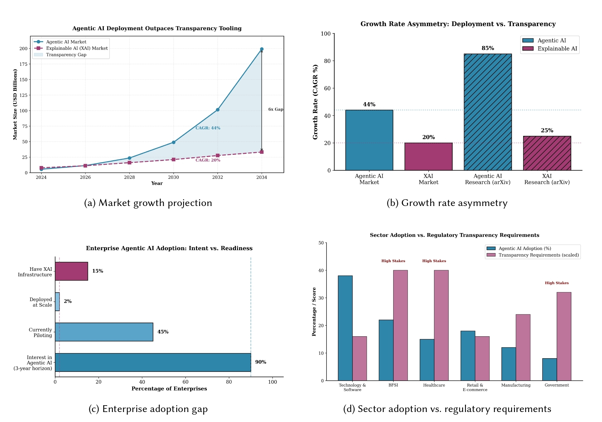
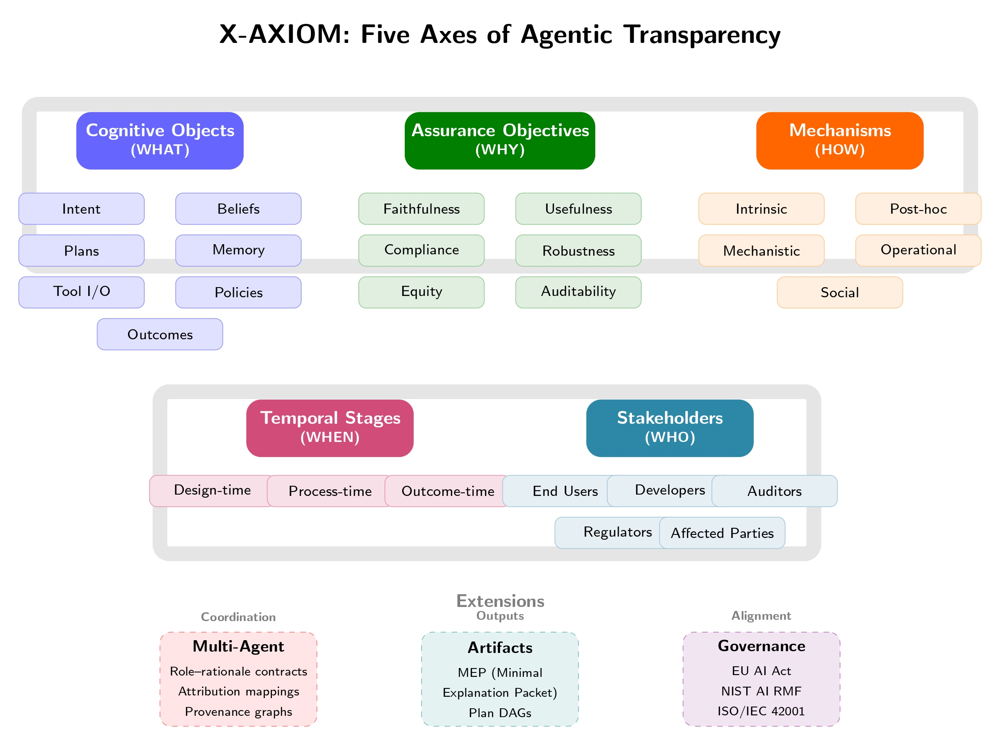
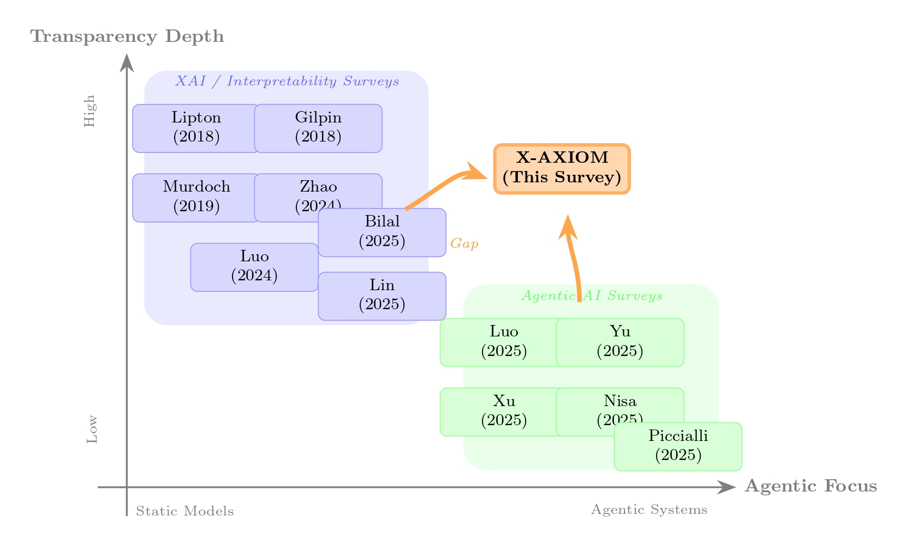

# Transparency in Agentic AI: A Survey of Interpretability, Explainability, and Governance

[]()
[](https://arxiv.org/abs/XXXX.XXXXX)

🔥 **[Paper Link](link-to-paper)** 🔥

<div align="center">
  
  <p><em><b>Figure 1:</b> The transparency gap in agentic AI. (a) Market growth projection shows agentic AI deployment outpacing XAI tooling by 6× by 2034. (b) Growth rates confirm the asymmetry in both market and research output. (c) Enterprise adoption reveals a stark gap between intent (90%) and deployment at scale (2%). (d) Sectors with highest adoption (BFSI, Healthcare, Government) also face the strictest transparency requirements.</em></p>
</div>

---

## 📌 Introduction

As agentic AI systems rapidly evolve from research prototypes to production deployments, a critical transparency gap has emerged. The global agentic AI market is projected to reach **USD 150-200 billion by 2033-2034** at 40-45% CAGR, while explainable AI (XAI) tools grow at only **half this rate**. This asymmetry creates acute challenges: over 90% of enterprises plan agentic AI deployment within three years, yet only 2% have deployed at scale, and just 15% have XAI infrastructure in place.

**The problem:** Existing XAI methods were designed for static models—not for agents that plan across multiple steps, use external tools, maintain memory, and coordinate with other agents.

This repository accompanies our survey paper **"Agentic Transparency: A Practical Taxonomy for Interpretability and Explainability (X-AXIOM)"** which provides the **first unified framework** for transparency in LLM-based agentic systems.

---

## 📄 Survey Paper

**Title:** Agentic Transparency: A Practical Taxonomy for Interpretability and Explainability (X-AXIOM)  
**Authors:** [Author Names]  
**Institutions:** [Institution Names]  
**Published:** ACM [Conference/Journal] 2025  
**Link:** [Paper URL](link-to-paper)

---

## 🚀 Key Contributions

**X-AXIOM** introduces four major contributions to agentic transparency:

1. **Five-Axis Taxonomy** (WHAT • WHY • HOW • WHEN • WHO)  
   A unified framework organizing transparency across cognitive objects, assurance objectives, mechanisms, temporal stages, and stakeholders.

2. **Cognitive Audit Surface**  
   Formalization of internal structures for transparency: intent, beliefs, plans, memory, tool I/O, policies, and outcomes.

3. **Assurance-Driven Objectives**  
   Six objectives (faithfulness, usefulness, compliance, robustness, equity, auditability) mapped to governance frameworks (EU AI Act, NIST AI RMF, ISO/IEC 42001).

4. **Comprehensive Method Survey & Gap Analysis**  
   Systematic mapping of 150+ interpretability and explainability methods, revealing critical gaps for multi-step planning, tool use, memory, and multi-agent coordination.

---

## 🏗️ The X-AXIOM Framework

<div align="center">
  
  <p><em><b>Figure 2:</b> The X-AXIOM taxonomy for agentic transparency. The framework organizes transparency along five core axes: Cognitive Objects (WHAT is exposed), Assurance Objectives (WHY transparency is needed), Mechanisms (HOW transparency is achieved), Temporal Stages (WHEN in the lifecycle), and Stakeholders (WHO requires transparency). Extensions address multi-agent coordination, the Minimal Explanation Packet (MEP), and alignment with governance frameworks.</em></p>
</div>

X-AXIOM structures agentic transparency along **five complementary axes**:

### 🎯 Axis 1: WHAT (Cognitive Objects)
The internal states that shape agent behavior:
- **Intent (G)**: Goals and objectives
- **Beliefs**: World model and knowledge state  
- **Plans (P)**: Action sequences and alternatives
- **Memory (S)**: Persistent state across interactions
- **Tool I/O (T)**: External tool invocations
- **Policies (π)**: Guardrails and constraints
- **Outcomes**: Actions taken and effects

### ❓ Axis 2: WHY (Assurance Objectives)
Why transparency is needed:
- **Faithfulness**: Explanations reflect actual behavior
- **Usefulness**: Explanations support decisions
- **Compliance**: Satisfies regulatory requirements
- **Robustness**: Stable under adversarial conditions
- **Equity**: Surfaces and mitigates bias
- **Auditability**: Supports external review

### ⚙️ Axis 3: HOW (Mechanisms)
How transparency is achieved:
- **Intrinsic**: Built into agent architecture
- **Post-hoc**: Applied after execution
- **Mechanistic**: Causal interventions
- **Operational**: Trace logging and provenance
- **Social**: Interactive explanations

### ⏰ Axis 4: WHEN (Temporal Stages)
When in the lifecycle:
- **Design-time**: Architectural transparency choices
- **Process-time**: Real-time monitoring during execution
- **Outcome-time**: Post-hoc explanation generation

### 👥 Axis 5: WHO (Stakeholders)
Who requires transparency:
- **End Users**: Actionable explanations and recourse
- **Developers**: Debugging and error diagnosis
- **Auditors**: Verifiable evidence and replay
- **Regulators**: Compliance documentation
- **Affected Parties**: Aggregate transparency

### 📦 Key Artifact: Minimal Explanation Packet (MEP)
A standardized, cryptographically-signed record containing:
- Plan summary with decision points and alternatives
- Tool traces (inputs/outputs/errors)
- Evidence references with cryptographic hashes
- Policy activation logs and fairness deltas
- Timestamps and signatures for auditability

---

## 💡 What Makes X-AXIOM Different?

<div align="center">
  
  <p><em><b>Figure 3:</b> Positioning of X-AXIOM relative to existing literature. Prior work clusters in two regions: XAI/interpretability surveys focused on static models (left), and agentic AI surveys with limited transparency coverage (bottom-right). X-AXIOM occupies the intersection, addressing transparency challenges specific to agentic systems.</em></p>
</div>

Prior surveys fall into two non-overlapping groups:
- **XAI/Interpretability surveys** focus on static models (left side of chart)
- **Agentic AI surveys** treat transparency superficially (bottom-right)

**X-AXIOM bridges this gap** as the first survey addressing:

✅ Full agent lifecycle (design → process → outcome)  
✅ Multi-agent coordination transparency  
✅ Tool use and memory interpretability  
✅ Governance alignment (EU AI Act, NIST, ISO)  
✅ Practical evaluation protocols  

### Comparison with Related Surveys

| Survey | Year | Explainability | Interpretability | Agentic | Multi-Agent | Lifecycle Coverage |
|--------|------|:--------------:|:----------------:|:-------:|:-----------:|:------------------:|
| Lipton [65] | 2018 | ✗ | ✓ | ✗ | ✗ | Static models |
| Gilpin et al. [41] | 2018 | ✓ | ✓ | ✗ | ✗ | Post-hoc methods |
| Murdoch et al. [85] | 2019 | ✓ | ✓ | ✗ | ✗ | Model-based |
| Zhao et al. [154] | 2024 | ✓ | ✓ | ✗ | ✗ | LLM-focused |
| Wang et al. [130] | 2024 | ✗ | ✗ | ✓ | ✗ | Agent architectures |
| Lin et al. [71] | 2025 | ✗ | ✗ | ✓ | ✗ | Agent workflows |
| **X-AXIOM (Ours)** | **2025** | **✓** | **✓** | **✓** | **✓** | **Full lifecycle** |

---

## 🆕 News & Updates

**[2025/01]** Paper submitted. We will continuously update this repository as new methods emerge in agentic transparency.

**[2025/01]** Repository created to maintain papers on interpretability and explainability for LLM-based agents.

---

## 💎 Table of Contents

- [Introduction](#-introduction)
- [Survey Paper](#-survey-paper)
- [Key Contributions](#-key-contributions)
- [The X-AXIOM Framework](#-the-x-axiom-framework)
- [What Makes X-AXIOM Different](#-what-makes-x-axiom-different)
- [Papers by Category](#-papers-by-category)
  - [Interpretability Methods (Design- & Process-time)](#interpretability-methods-design--process-time)
  - [Explainability Methods (Process- & Outcome-time)](#explainability-methods-process--outcome-time)
  - [Evaluation & Benchmarks](#evaluation--benchmarks)
  - [Governance & Compliance](#governance--compliance)
  - [Related Surveys](#related-surveys)
- [Research Gaps & Future Directions](#-research-gaps--future-directions)
- [Contributing](#-contributing)
- [Citation](#-citation)
- [Contact](#-contact)

---

# 📖 Papers by Category

We organize papers according to the X-AXIOM framework axes and the agent lifecycle.

## Interpretability Methods (Design- & Process-time)

### Perception Layer Interpretability

**Visual Feature Attribution**

[2014] Visualizing and understanding convolutional networks. *Matthew D Zeiler et al.* [[paper]](https://arxiv.org/abs/1311.2901)

[2016] Grad-CAM: Why did you say that? *Ramprasaath R Selvaraju et al.* [[paper]](https://arxiv.org/abs/1610.02391)

[2013] Deep inside convolutional networks. *Karen Simonyan et al.* [[paper]](https://arxiv.org/abs/1312.6034)

**Vision-Language Models**

[2024] A Concept-Based Explainability Framework for Large Multimodal Models. *Mohammad Shukor et al.* [[paper]](https://proceedings.neurips.cc/paper_files/paper/2024/file/f4fba41b554f9aaa013c4062a1c40518-Paper-Conference.pdf)

[2020] Behind the scene: Revealing the secrets of pre-trained vision-and-language models. *Jize Cao et al.* [[paper]](https://arxiv.org/abs/2005.07310)

---

### Reasoning and Planning Interpretability

**Probing Methods**

[2016] Understanding intermediate layers using linear classifier probes. *Guillaume Alain et al.* [[paper]](https://arxiv.org/abs/1610.01644)

[2019] A structural probe for finding syntax in word representations. *John Hewitt et al.* [[paper]](https://aclanthology.org/N19-1419/)

[2024] Inference Optimal VLMs Need Fewer Visual Tokens. *Kevin Y Li et al.* [[paper]](https://arxiv.org/abs/2411.03312)

**Mechanistic Interpretability**

[2020] Zoom in: An introduction to circuits. *Chris Olah et al.* [[paper]](https://distill.pub/2020/circuits/zoom-in/)

[2022] Interpretability in the wild: indirect object identification. *Kevin Wang et al.* [[paper]](https://arxiv.org/abs/2211.00593)

[2023] Towards automated circuit discovery. *Arthur Conmy et al.* [[paper]](https://arxiv.org/abs/2304.14997)

[2023] Sparse autoencoders find highly interpretable features. *Hoagy Cunningham et al.* [[paper]](https://arxiv.org/abs/2309.08600)

[2024] Mechanistic interpretability for AI safety. *Leonard Bereska et al.* [[paper]](https://arxiv.org/abs/2404.14082)

**Attention Analysis**

[2019] What Does BERT Look At? *Kevin Clark et al.* [[paper]](https://aclanthology.org/P19-1580/)

[2020] Quantifying attention flow in transformers. *Samira Abnar et al.* [[paper]](https://arxiv.org/abs/2005.00928)

[2021] Transformer interpretability beyond attention. *Hila Chefer et al.* [[paper]](https://arxiv.org/abs/2012.09838)

---

### Tool Use Interpretability

**Tool Tracing & Attribution**

[2023] Toolformer: Language models can teach themselves to use tools. *Timo Schick et al.* [[paper]](https://arxiv.org/abs/2302.04761)

[2025] AgentSHAP: Interpreting LLM Agent Tool Importance. *Miriam Horovicz.* [[paper]](https://arxiv.org/abs/2512.12597)

**Tool-Use Evaluation**

[2024] GTA: a benchmark for general tool agents. *Jize Wang et al.* [[paper]](https://arxiv.org/abs/2407.08713)

[2025] MCP-Bench: Benchmarking tool-using llm agents. *Zhenting Wang et al.* [[paper]](https://arxiv.org/abs/2508.20453)

---

### Memory and Belief Interpretability

**Memory Analysis**

[2023] Generative agents: Interactive simulacra of human behavior. *Joon Sung Park et al.* [[paper]](https://arxiv.org/abs/2304.03442)

[2024] Lost in the middle: How language models use long contexts. *Nelson F Liu et al.* [[paper]](https://arxiv.org/abs/2307.03172)

[2025] MemBench: Comprehensive evaluation on agent memory. *Haoran Tan et al.* [[paper]](https://arxiv.org/abs/2506.21605)

**Retrieval Attribution**

[2023] Retrieval-Augmented Generation: A Survey. *Yunfan Gao et al.* [[paper]](https://arxiv.org/abs/2312.10997)

[2025] KGRAG-Ex: Explainable RAG with Knowledge Graphs. *Georgios Balanos et al.* [[paper]](https://arxiv.org/abs/2507.08443)

---

### Multi-Agent Interpretability

**Communication & Coordination**

[2023] CAMEL: Communicative agents for mind exploration. *Guohao Li et al.* [[paper]](https://arxiv.org/abs/2303.17760)

[2024] NetSafe: Topological Safety of Multi-agent Networks. *Miao Yu et al.* [[paper]](https://arxiv.org/abs/2410.15686)

[2025] G-Safeguard: Topology-Guided Security Treatment. *Shilong Wang et al.* [[paper]](https://arxiv.org/abs/2502.11127)

---

### Causal Interventions & Agent-Loop Probes

**Activation Patching**

[2022] Locating and Editing Factual Associations in GPT. *Kevin Meng et al.* [[paper]](https://arxiv.org/abs/2202.05262)

[2024] Mechanistic Interpretability with Activation Patching. *Zhen Wang et al.* [[paper]](https://arxiv.org/abs/2407.11215)

**Agentic Interpretability**

[2025] Because we have LLMs, we Can Pursue Agentic Interpretability. *Been Kim et al.* [[paper]](https://arxiv.org/abs/2506.12152)

**Provenance & Traceability**

[2013] PROV-Overview. *W3C Provenance Working Group.* [[spec]](https://www.w3.org/TR/prov-overview/)

[2025] Traceability in Multi-Agent LLM Pipelines. *Amine Barrak.* [[paper]](https://arxiv.org/abs/2510.07614)

---

## Explainability Methods (Process- & Outcome-time)

### Reasoning & Planning Explanations

**Chain-of-Thought**

[2022] Chain-of-thought prompting elicits reasoning. *Jason Wei et al.* [[paper]](https://arxiv.org/abs/2201.11903)

[2023] Tree of thoughts: Deliberate problem solving. *Shunyu Yao et al.* [[paper]](https://arxiv.org/abs/2305.10601)

[2024] Graph of thoughts. *Maciej Besta et al.* [[paper]](https://arxiv.org/abs/2308.09687)

[2025] Layered Chain-of-Thought for Multi-Agent Systems. *Hao Wang et al.* [[paper]](https://arxiv.org/abs/2501.18645)

**Reasoning Traces & Reflection**

[2023] ReAct: Synergizing Reasoning and Acting. *Shunyu Yao et al.* [[paper]](https://arxiv.org/abs/2210.03629)

[2023] Reflexion: Dynamic Memory and Self-Reflection. *Noah Shinn et al.* [[paper]](https://arxiv.org/abs/2303.11366)

[2024] Self-Reflection in LLM Agents. *Matthew Renze et al.* [[paper]](https://arxiv.org/abs/2405.06682)

**Faithfulness**

[2023] Faithful chain-of-thought reasoning. *Qing Lyu et al.* [[paper]](https://arxiv.org/abs/2301.13379)

[2023] Language Models Don't Always Say What They Think. *Miles Turpin et al.* [[paper]](https://arxiv.org/abs/2305.04388)

---

### Retrieval & Evidence Attribution

[2019] A Multiscale Visualization of Attention. *Jesse Vig.* [[paper]](https://arxiv.org/abs/1904.02679)

---

### Tool Use Explanations

[2025] AgentSHAP: Tool importance with Shapley values. *Miriam Horovicz.* [[paper]](https://arxiv.org/abs/2512.12597)

---

### Counterfactual Explanations

[2017] Counterfactual explanations without opening the black box. *Sandra Wachter et al.* [[paper]](https://arxiv.org/abs/1711.00399)

[2023] Do Models Explain Themselves? Counterfactual Simulatability. *Yanda Chen et al.* [[paper]](https://arxiv.org/abs/2307.08678)

---

### Interactive & User-Centered Explanations

[2024] x-plAIn: Human-Centered Prompting for XAI. *Philip Mavrepis et al.* [[paper]](https://arxiv.org/abs/2401.13110)

[2024] Usable XAI: 10 strategies in the LLM era. *Xuansheng Wu et al.* [[paper]](https://arxiv.org/abs/2403.08946)

---

## Evaluation & Benchmarks

### Agent Performance Benchmarks

**Multi-Turn & Long-Horizon**

[2024] τ-bench: Tool-Agent-User Interaction. *Shunyu Yao et al.* [[paper]](https://arxiv.org/abs/2406.12045)

[2024] AssistantBench: Realistic and time-consuming tasks. *Ori Yoran et al.* [[paper]](https://arxiv.org/abs/2407.15711)

[2024] TheAgentCompany: Real-world tasks. *Frank F Xu et al.* [[paper]](https://arxiv.org/abs/2412.14161)

**Tool Use**

[2024] GTA: General tool agents benchmark. *Jize Wang et al.* [[paper]](https://arxiv.org/abs/2407.08713)

[2025] The Tool Decathlon. *Junlong Li et al.* [[paper]](https://arxiv.org/abs/2510.25726)

**Planning & Reasoning**

[2024] Agent GPA: Goal-Plan-Action Alignment. *Allison Sihan Jia et al.* [[paper]](https://arxiv.org/abs/2510.08847)

[2025] Can LLMs Truly Plan? *Gayeon Jung et al.* [[paper]](https://aclanthology.org/2025.findings-emnlp.774/)

**Memory**

[2024] Long-term conversational memory. *Adyasha Maharana et al.* [[paper]](https://arxiv.org/abs/2402.17753)

[2025] MemBench. *Haoran Tan et al.* [[paper]](https://arxiv.org/abs/2506.21605)

**Multi-Agent**

[2024] MAgIC: Multi-agent cognition, adaptability, collaboration. *Lin Xu et al.* [[paper]](https://arxiv.org/abs/2309.12223)

[2025] MultiAgentBench. *Kunlun Zhu et al.* [[paper]](https://arxiv.org/abs/2503.01935)

**Safety & Risk**

[2024] R-Judge: Safety risk awareness. *Tongxin Yuan et al.* [[paper]](https://arxiv.org/abs/2401.10019)

[2024] Agent-SafetyBench. *Zhexin Zhang et al.* [[paper]](https://arxiv.org/abs/2412.14470)

[2024] AgentHarm. *Maksym Andriushchenko et al.* [[paper]](https://arxiv.org/abs/2410.09024)

---

### Transparency Quality Evaluation

**Faithfulness**

[2016] "Why Should I Trust You?": LIME. *Marco Tulio Ribeiro et al.* [[paper]](https://arxiv.org/abs/1602.04938)

[2020] Fooling LIME and SHAP. *Dylan Slack et al.* [[paper]](https://arxiv.org/abs/1911.02508)

**Interpretability Foundations**

[2017] Towards rigorous interpretable ML. *Finale Doshi-Velez et al.* [[paper]](https://arxiv.org/abs/1702.08608)

[2018] TCAV: Testing with Concept Activation Vectors. *Been Kim et al.* [[paper]](https://arxiv.org/abs/1711.11279)

---

## Governance & Compliance

### Regulatory Frameworks

**EU AI Act** - [Link](https://eur-lex.europa.eu/legal-content/EN/TXT/?uri=CELEX:52021PC0206)

**NIST AI RMF** - [Link](https://nvlpubs.nist.gov/nistpubs/ai/NIST.AI.100-1.pdf)

**ISO/IEC 42001** - [Link](https://www.iso.org/standard/81230.html)

---

### Governance Technologies

[2025] TRiSM for Agentic AI. *Shaina Raza et al.* [[paper]](https://arxiv.org/abs/2506.04133)

[2019] Model Cards for Model Reporting. *Margaret Mitchell et al.* [[paper]](https://arxiv.org/abs/1810.03993)

[2021] Datasheets for datasets. *Timnit Gebru et al.* [[paper]](https://arxiv.org/abs/1803.09010)

---

## Related Surveys

### XAI & Interpretability Surveys

[2018] The mythos of model interpretability. *Zachary C Lipton.* [[paper]](https://arxiv.org/abs/1606.03490)

[2018] Explaining explanations: An overview. *Leilani H Gilpin et al.* [[paper]](https://ieeexplore.ieee.org/document/8631448)

[2019] Interpretable machine learning. *W James Murdoch et al.* [[paper]](https://arxiv.org/abs/1901.04592)

[2024] Explainability for LLMs. *Haiyan Zhao et al.* [[paper]](https://arxiv.org/abs/2309.01029)

[2024] From Understanding to Utilization. *Haoyan Luo et al.* [[paper]](https://arxiv.org/abs/2401.12874)

[2025] LLMs for Explainable AI. *Ahsan Bilal et al.* [[paper]](https://arxiv.org/abs/2504.00125)

---

### Agentic AI Surveys

[2024] A survey on LLM based autonomous agents. *Lei Wang et al.* [[paper]](https://arxiv.org/abs/2308.11432)

[2025] LLM agent: methodology, applications, challenges. *Junyu Luo et al.* [[paper]](https://arxiv.org/abs/2503.21460)

[2025] Agentic large language models, a survey. *Aske Plaat et al.* [[paper]](https://arxiv.org/abs/2503.23037)

[2025] LLM-Based Agents for Tool Learning. *Weikai Xu et al.* [[paper]](https://link.springer.com/article/10.1007/s41019-024-00259-2)

---

### Mechanistic Interpretability

[2024] Mechanistic interpretability for AI safety. *Leonard Bereska et al.* [[paper]](https://arxiv.org/abs/2404.14082)

[2025] Mechanistic interpretability for multimodal models. *Zihao Lin et al.* [[paper]](https://arxiv.org/abs/2502.17516)

---

# 🔬 Research Gaps & Future Directions

Our survey identifies **critical gaps** where current methods fall short:

### 🔴 **Multi-Step Faithfulness**
Current methods explain individual steps but struggle across long trajectories where plan-trace drift accumulates. **Open challenge:** How to maintain explanation faithfulness across 100+ step agent executions?

### 🔴 **Tool Use Attribution**
Limited techniques for attributing outcomes to specific tool calls in complex workflows. **Open challenge:** Causal attribution when tools are chained and interact.

### 🔴 **Memory & Belief Tracking**
Sparse coverage of how beliefs evolve through retrieval and memory updates. **Open challenge:** Visualizing belief state evolution over extended interactions.

### 🔴 **Multi-Agent Coordination**
Near-total gap in understanding distributed decision-making and emergent behaviors. **Open challenge:** Attribution in systems where no single agent made "the decision."

### 🔴 **Uncertainty Communication**
Agents rarely communicate appropriate uncertainty when evidence conflicts. **Open challenge:** Calibrated confidence intervals for agent recommendations.

### 🔴 **Temporal Explanations**
Explaining how plans changed mid-execution requires new structures. **Open challenge:** Explaining why the agent changed its mind.

---

# 🤝 Contributing

This is a **living repository**. We actively welcome contributions as agentic transparency is a rapidly evolving field.

### How to Contribute

**📝 Add Papers**
- Submit via pull request with proper categorization
- Use format: `[Year] Title. *Authors.* [[paper]](link)`
- Include brief description if adding new category

**💡 Suggest Improvements**
- Open issues for missing categories or papers
- Propose better organization structures
- Report broken links or errors

**🔬 Share Research**
- Implementing X-AXIOM framework? Let us know!
- Published work using this taxonomy? We'll link it!

---

# 📜 Citation

If you find X-AXIOM useful in your research, please cite:

```bibtex
@article{authors2025xaxiom,
  title={Agentic Transparency: A Practical Taxonomy for Interpretability and Explainability (X-AXIOM)},
  author={Author, First and Author, Second},
  journal={ACM Journal Name},
  volume={37},
  number={4},
  pages={1--36},
  year={2025},
  publisher={ACM},
  doi={XXXXXXX.XXXXXXX}
}
```

---

# 📧 Contact

**Authors:**
- First Author Name - email@institution.edu
- Second Author Name - email@institution.edu

**Questions?** Open an issue or email us directly.

**Collaboration?** We're interested in partnerships on agentic transparency research!

---

# 📋 License

This repository is licensed under the MIT License - see LICENSE file for details.

---

# 🙏 Acknowledgments

We thank the research community for valuable feedback. This work builds on foundational contributions in interpretability, explainability, agentic AI architectures, and AI governance.

Special thanks to reviewers and early adopters of the X-AXIOM framework.

---

<div align="center">

**[⬆ Back to Top](#x-axiom-agentic-transparency)**

Made with care by the X-AXIOM Research Team

</div>
