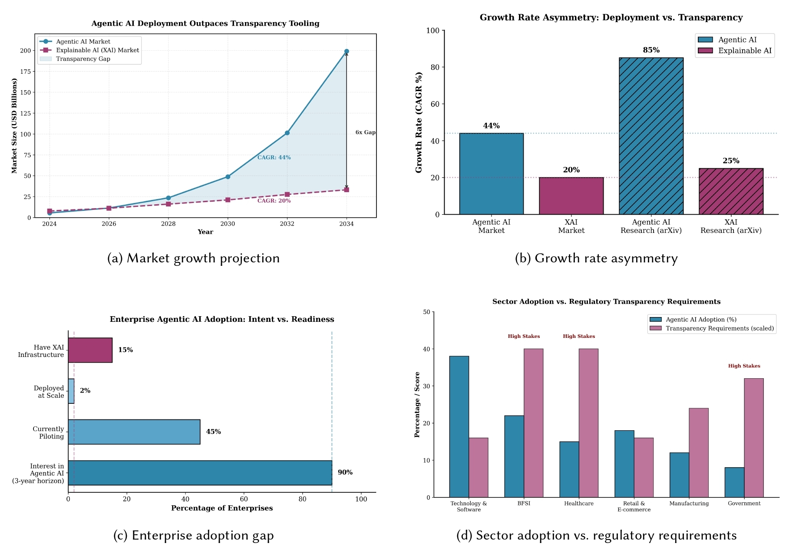
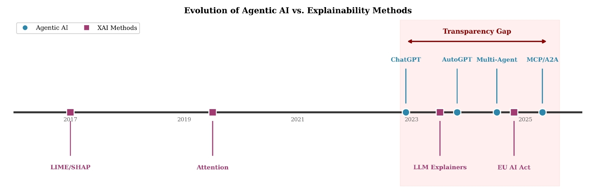
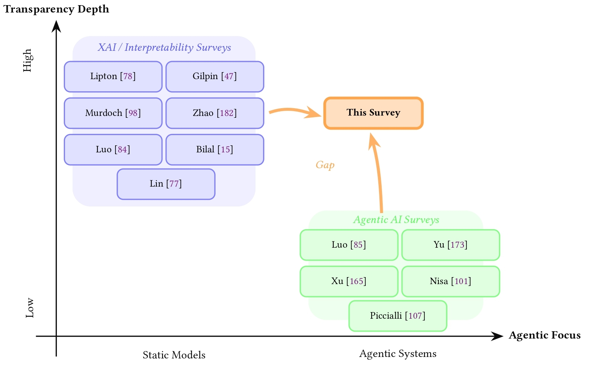
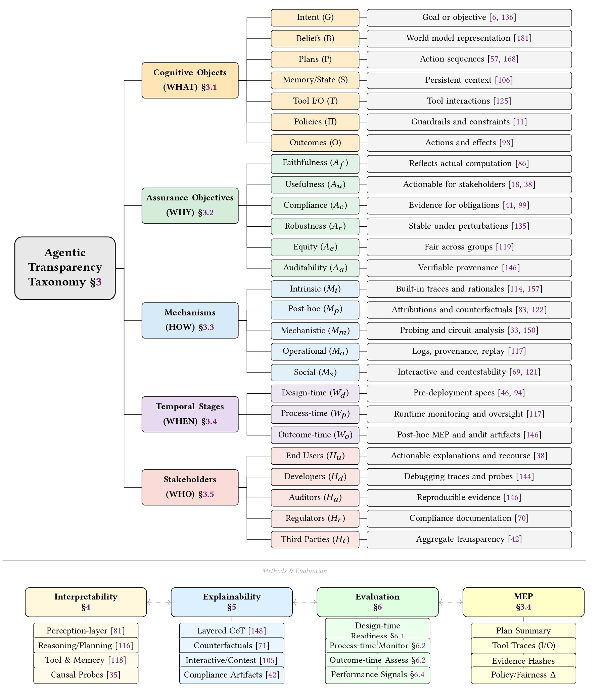
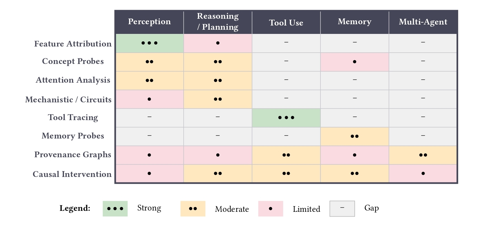
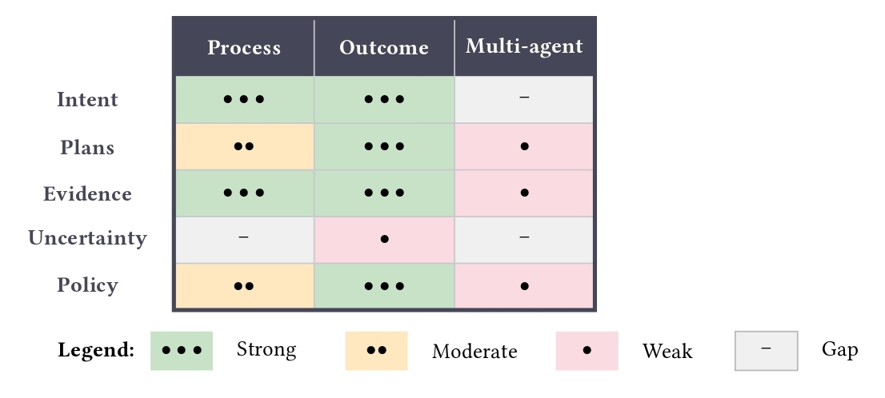
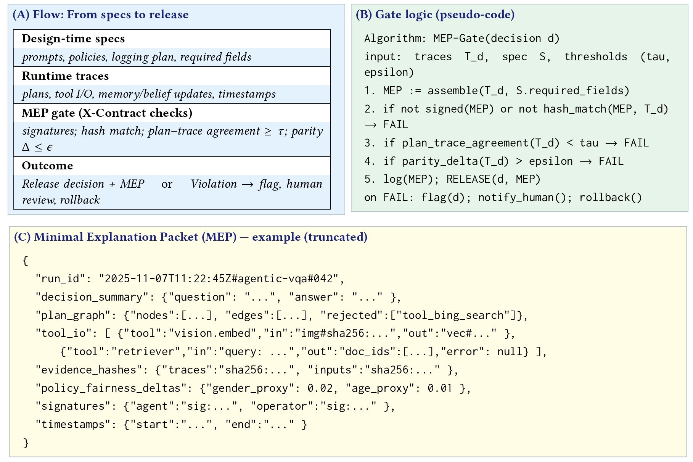
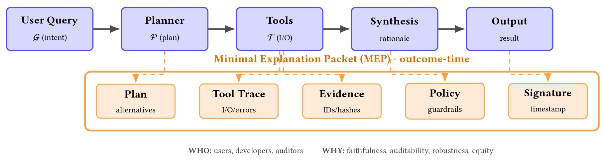
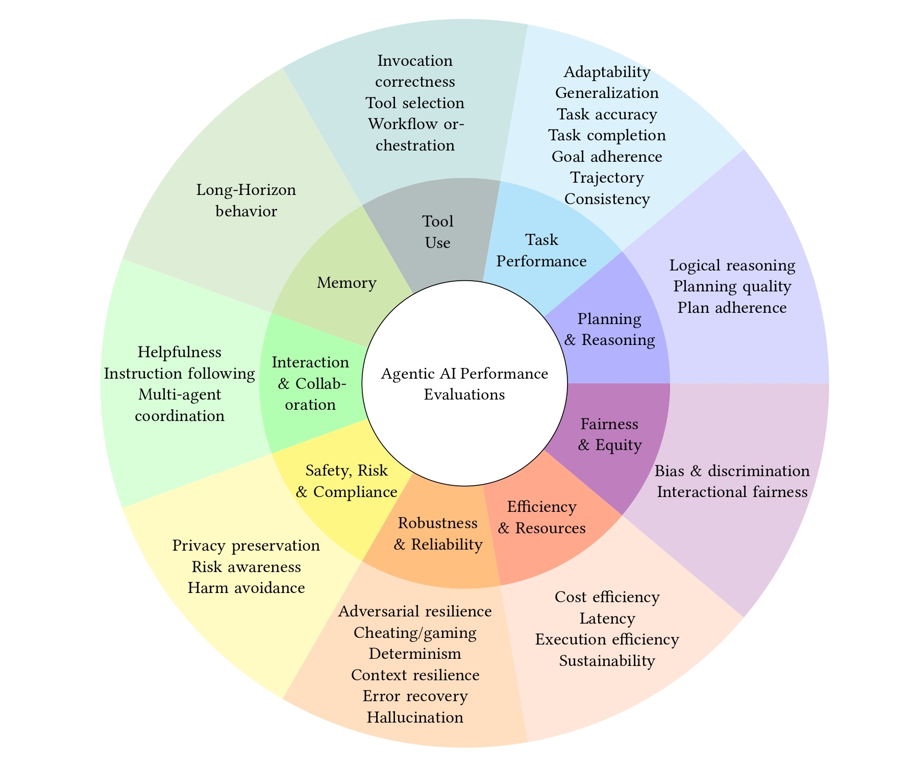

# Transparency in Agentic AI: A Survey of Interpretability, Explainability, and Governance
[](https://engrxiv.org/preprint/view/6451)
[](https://vectorinstitute.github.io/Agentic-Transparency/)

---

<div align="center">
  
  <p><em>The transparency gap in agentic AI showing market growth asymmetry, research output gaps, enterprise adoption challenges, and sectoral requirements.</em></p>
</div>

## 🌟 Overview

Transparency in Agentic AI: A Survey of Interpretability, Explainability, and Governance

Welcome to our Transparency in Agentic AI survey paper repository. This comprehensive collection documents interpretability and explainability methods for LLM-based agentic systems, covering the full agent lifecycle from design through deployment.

**Authors:** Shaina Raza¹, Ahmed Y. Radwan¹, Sindhuja Chaduvula¹, Mahshid Alinoori¹, Christos Emmanouilidis²

¹Vector Institute for Artificial Intelligence · ²University of Groningen

---

## What is Agentic AI Transparency?

Transparency in Agentic AI encompasses the principles, practices, and frameworks governing the interpretability and explainability of LLM-based agents that plan across multiple steps, use external tools, maintain memory, and coordinate with other agents. Unlike traditional XAI methods designed for static models, agentic transparency addresses the unique challenges of multi-step reasoning, tool interaction, stateful memory, and multi-agent coordination.

---

## 📊 The Transparency Gap (2022-2025)

<div align="center">
  
  <p><em>Evolution of methods showing the "transparency gap" period (2022–present) where Agentic AI development has accelerated while explainability methods remain focused on static models.</em></p>
</div>

**Key Trends:**
- **Market Asymmetry**: Global Agentic AI market projected to reach USD 150-200 billion by 2033-2034, growing 6× faster than XAI tools
- **Research Gap**: XAI/interpretability surveys focus on static models while agentic AI surveys treat transparency as secondary
- **Enterprise Challenge**: 90% plan agentic AI deployment within three years, yet only 2% have deployed at scale
- **Regulatory Pressure**: Sectors driving adoption (banking, healthcare, government) face strictest transparency requirements (EU AI Act, NIST AI RMF, ISO/IEC 42001)

This repository provides comprehensive coverage across:
- **Interpretability Methods** - Design-time and process-time transparency for perception, reasoning, tool use, memory, and multi-agent systems
- **Explainability Methods** - Process-time and outcome-time explanations including chain-of-thought, faithfulness, and counterfactuals
- **Evaluation & Benchmarks** - Assessment frameworks for multi-turn tasks, tool use, planning, memory, multi-agent systems, and safety
- **Governance & Compliance** - Regulatory frameworks (EU AI Act, NIST, ISO/IEC 42001) and governance technologies

---

## 🎯 Survey Positioning

<div align="center">
  
  <p><em>This survey occupies the intersection of XAI/interpretability and agentic AI research, addressing transparency challenges specific to agentic systems.</em></p>
</div>

---

## 🏗️ Five-Axis Taxonomy

<div align="center">
  
  <p><em>The five-axis taxonomy organizing transparency across WHAT (cognitive objects), WHY (assurance objectives), HOW (mechanisms), WHEN (temporal stages), and WHO (stakeholders).</em></p>
</div>

Our framework organizes transparency along five complementary dimensions: **Cognitive Objects (WHAT)**, **Assurance Objectives (WHY)**, **Mechanisms (HOW)**, **Temporal Stages (WHEN)**, and **Stakeholders (WHO)**.

---

## 📖 Papers by Category

### 1. Interpretability Methods

#### 1.1 Perception & Vision-Language Models

**Recent Advances (2024-2025)**

• [2025] **Seeing but Not Believing: Probing the Disconnect Between Visual Attention and Answer Correctness in VLMs**  *Zhining Liu et al.* [[paper](https://arxiv.org/html/2510.17771v1)]

. [2025] **Perspective-Aware Reasoning in Vision-Language Models via Mental Imagery Simulation** *P.Y. Lee et al.* [[paper](https://arxiv.org/pdf/2504.17207)]

• [2024] **A Concept-Based Explainability Framework for Large Multimodal Models** *Mohammad Shukor et al.* [[paper](https://proceedings.neurips.cc/paper_files/paper/2024/file/f4fba41b554f9aaa013c4062a1c40518-Paper-Conference.pdf)]

• [2024] **Inference Optimal VLMs Need Fewer Visual Tokens** *Kevin Y Li et al.* [[paper](https://arxiv.org/abs/2411.03312)]

**Foundational Works (2013-2020)**

• [2020] **Behind the Scene: Revealing the Secrets of Pre-trained Vision-and-Language Models** *Jize Cao et al.* [[paper](https://arxiv.org/abs/2005.07310)]

• [2016] **Grad-CAM: Visual Explanations from Deep Networks via Gradient-based Localization** *Ramprasaath R Selvaraju et al.* [[paper](https://arxiv.org/abs/1610.02391)]

• [2014] **Visualizing and Understanding Convolutional Networks** *Matthew D Zeiler et al.* [[paper](https://arxiv.org/abs/1311.2901)]

• [2013] **Deep Inside Convolutional Networks: Visualising Image Classification Models and Saliency Maps** *Karen Simonyan et al.* [[paper](https://arxiv.org/abs/1312.6034)]

#### 1.2 Mechanistic Interpretability

**Recent Advances (2023-2025)**

• [2025] **The Mechanistic Emergence of Symbol Grounding in Language Models**  *Shuyu Wu et al.* [[paper](https://arxiv.org/html/2510.13796v1)]

. [2025] **Causal Tracing of Object Representations in Large Vision Language Models: Mechanistic Interpretability and Hallucination Mitigation** *Qiming Li et al.* [[paper](https://arxiv.org/abs/2511.05923)]

• [2024] **Mechanistic Interpretability for AI Safety: A Review** *Leonard Bereska et al.* [[paper](https://arxiv.org/abs/2404.14082)]

• [2024] **Mechanistic Interpretability with Activation Patching** *Zhen Wang et al.* [[paper](https://arxiv.org/abs/2407.11215)]

• [2023] **Sparse Autoencoders Find Highly Interpretable Features in Language Models** *Hoagy Cunningham et al.* [[paper](https://arxiv.org/abs/2309.08600)]

• [2023] **Towards Automated Circuit Discovery for Mechanistic Interpretability** *Arthur Conmy et al.* [[paper](https://arxiv.org/abs/2304.14997)]

**Early Works (2020-2022)**

• [2022] **Interpretability in the Wild: a Circuit for Indirect Object Identification in GPT-2 small** *Kevin Wang et al.* [[paper](https://arxiv.org/abs/2211.00593)]

• [2020] **Zoom In: An Introduction to Circuits** *Chris Olah et al.* [[paper](https://distill.pub/2020/circuits/zoom-in/)]

#### 1.3 Probing & Representation Analysis

**Recent Advances (2023-2025)**

• [2025] **Linear Personality Probing and Steering in LLMs: A Big Five Study**  *Michel Frising, Daniel Balcells* (submitted) [[paper](https://arxiv.org/abs/2512.17639)]

• [2025] **CoT Vectors: Transferring and Probing the Reasoning Mechanisms of LLMs**  *Li Li et al.* (submitted) [[paper](https://arxiv.org/abs/2510.00579)]

• [2024] **Probing Language Models on Their Knowledge Source**  *Tighidet et al.* [[paper](https://arxiv.org/abs/2410.05817)]

• [2024] **Probing Conceptual Understanding of Large Visual-Language Models**  *Schiappa et al.* [[paper](https://arxiv.org/abs/2304.03659)]

• [2023] **The Linear Representation Hypothesis and the Geometry of Large Language Models**  *Kiho Park et al.* [[paper](https://arxiv.org/abs/2311.03658)]

**Early Works (2016-2019)**

• [2019] **A Structural Probe for Finding Syntax in Word Representations** *John Hewitt et al.* [[paper](https://aclanthology.org/N19-1419/)]

• [2016] **Understanding Intermediate Layers using Linear Classifier Probes** *Guillaume Alain et al.* [[paper](https://arxiv.org/abs/1610.01644)]

#### 1.4 Attention Analysis

**Recent Advances (2023-2025)**

• [2025] **Causal Head Gating: A Framework for Interpreting Roles of Attention Heads in Transformers**  *Andrew J. Nam et al.* [[paper](https://arxiv.org/abs/2505.13737)]

• [2025] **Interpreting Attention Heads for Image-to-Text Information Flow in Large Vision-Language Models**  *Jinyeong Kim et al.* [[paper](https://arxiv.org/abs/2509.17588)]

• [2024] **Faithful Attention Explainer: Verbalizing Decisions Based on Discriminative Features**  *Yao Rong et al.* [[paper](https://arxiv.org/abs/2405.13032)]

• [2023] **Causal Interpretation of Self-Attention in Pre-Trained Transformers**  *Raanan Y. Rohekar et al.* [[paper](https://arxiv.org/abs/2310.20307)]

**Early Works (2019-2021)**

• [2021] **Transformer Interpretability Beyond Attention Visualization** *Hila Chefer et al.* [[paper](https://arxiv.org/abs/2012.09838)]

• [2020] **Quantifying Attention Flow in Transformers** *Samira Abnar et al.* [[paper](https://arxiv.org/abs/2005.00928)]

• [2019] **What Does BERT Look At? An Analysis of BERT's Attention** *Kevin Clark et al.* [[paper](https://aclanthology.org/P19-1580/)]

#### 1.5 Tool Use Interpretability

**Latest Methods (2025)**

• [2025] **MCP-Bench: Benchmarking Tool-Using LLM Agents at Scale** *Zhenting Wang et al.* [[paper](https://arxiv.org/abs/2508.20453)]

• [2025] **AgentSHAP: Explaining Black-Box LLM Agent Tool Use with Shapley Values** *Miriam Horovicz* [[paper](https://arxiv.org/abs/2512.12597)]

**Earlier Works (2023-2024)**

• [2024] **GTA: A Benchmark for General Tool Agents** *Jize Wang et al.* [[paper](https://arxiv.org/abs/2407.08713)]

• [2023] **Toolformer: Language Models Can Teach Themselves to Use Tools** *Timo Schick et al.* [[paper](https://arxiv.org/abs/2302.04761)]

#### 1.6 Memory & Retrieval

**Recent Advances (2024-2025)**

• [2025] **MemBench: Memorization Capability Benchmark for Large Language Models** *Haoran Tan et al.* [[paper](https://arxiv.org/abs/2506.21605)]

• [2025] **KGRAG-Ex: Knowledge Graph-Enhanced Explainable Retrieval Augmented Generation** *Georgios Balanos et al.* [[paper](https://arxiv.org/abs/2507.08443)]

• [2024] **Lost in the Middle: How Language Models Use Long Contexts** *Nelson F Liu et al.* [[paper](https://arxiv.org/abs/2307.03172)]

**Foundational Work (2023)**

• [2023] **Retrieval-Augmented Generation for Large Language Models: A Survey** *Yunfan Gao et al.* [[paper](https://arxiv.org/abs/2312.10997)]

• [2023] **Generative Agents: Interactive Simulacra of Human Behavior** *Joon Sung Park et al.* [[paper](https://arxiv.org/abs/2304.03442)]

#### 1.7 Multi-Agent Interpretability

**Latest Research (2024-2025)**

• [2025] **G-Safeguard: Topology-Guided Security Treatment for Multi-Agent LLM Systems** *Shilong Wang et al.* [[paper](https://arxiv.org/abs/2502.11127)]

• [2024] **NetSafe: Ensuring Topological Safety in Multi-Agent Networks** *Miao Yu et al.* [[paper](https://arxiv.org/abs/2410.15686)]

**Early Work (2023)**

• [2023] **CAMEL: Communicative Agents for "Mind" Exploration of Large Language Model Society** *Guohao Li et al.* [[paper](https://arxiv.org/abs/2303.17760)]

#### 1.8 Causal Interventions & Provenance

**Latest Developments (2025)**

• [2025] **Traceability in Multi-Agent LLM Pipelines** *Amine Barrak* [[paper](https://arxiv.org/abs/2510.07614)]

• [2025] **Because we have LLMs, we Can Pursue Agentic Interpretability** *Been Kim et al.* [[paper](https://arxiv.org/abs/2506.12152)]

**Earlier Methods (2013-2022)**

• [2022] **Locating and Editing Factual Associations in GPT** *Kevin Meng et al.* [[paper](https://arxiv.org/abs/2202.05262)]

• [2013] **PROV-Overview: An Overview of the PROV Family of Documents** *W3C Provenance Working Group* [[spec](https://www.w3.org/TR/prov-overview/)]

---

### 2. Explainability Methods

#### 2.1 Chain-of-Thought & Reasoning

**Recent Advances (2024-2025)**

• [2025] **Layered Chain-of-Thought Reasoning for Multi-Agent Systems** *Hao Wang et al.* [[paper](https://arxiv.org/abs/2501.18645)]

• [2024] **Graph of Thoughts: Solving Elaborate Problems with Large Language Models** *Maciej Besta et al.* [[paper](https://arxiv.org/abs/2308.09687)]

• [2024] **Self-Reflection in LLM Agents: Effects on Problem-Solving Performance** *Matthew Renze et al.* [[paper](https://arxiv.org/abs/2405.06682)]

**Foundational Methods (2022-2023)**

• [2023] **Tree of Thoughts: Deliberate Problem Solving with Large Language Models** *Shunyu Yao et al.* [[paper](https://arxiv.org/abs/2305.10601)]

• [2023] **Reflexion: Language Agents with Verbal Reinforcement Learning** *Noah Shinn et al.* [[paper](https://arxiv.org/abs/2303.11366)]

• [2023] **ReAct: Synergizing Reasoning and Acting in Language Models** *Shunyu Yao et al.* [[paper](https://arxiv.org/abs/2210.03629)]

• [2022] **Chain-of-Thought Prompting Elicits Reasoning in Large Language Models** *Jason Wei et al.* [[paper](https://arxiv.org/abs/2201.11903)]

#### 2.2 Faithfulness & Truthfulness

• [2023] **Language Models Don't Always Say What They Think: Unfaithful Explanations in Chain-of-Thought Prompting** *Miles Turpin et al.* [[paper](https://arxiv.org/abs/2305.04388)]

• [2023] **Faithful Chain-of-Thought Reasoning** *Qing Lyu et al.* [[paper](https://arxiv.org/abs/2301.13379)]

• [2019] **A Multiscale Visualization of Attention in the Transformer Model** *Jesse Vig* [[paper](https://arxiv.org/abs/1904.02679)]

#### 2.3 Counterfactual Explanations

• [2023] **Do Models Explain Themselves? Counterfactual Simulatability of Natural Language Explanations** *Yanda Chen et al.* [[paper](https://arxiv.org/abs/2307.08678)]

• [2017] **Counterfactual Explanations Without Opening the Black Box: Automated Decisions and the GDPR** *Sandra Wachter et al.* [[paper](https://arxiv.org/abs/1711.00399)]

#### 2.4 Interactive & User-Centered XAI

• [2024] **Usable XAI: 10 Strategies Towards Exploiting Explainability in the LLM Era** *Xuansheng Wu et al.* [[paper](https://arxiv.org/abs/2403.08946)]

• [2024] **x-plAIn: Explainable AI Through Human-Centered Prompting and Interactive Explanations** *Philip Mavrepis et al.* [[paper](https://arxiv.org/abs/2401.13110)]

---

### 3. Evaluation & Benchmarks

#### 3.1 Multi-Turn & Long-Horizon Tasks

• [2024] **TheAgentCompany: Benchmarking LLM Agents on Consequential Real-World Tasks** *Frank F Xu et al.* [[paper](https://arxiv.org/abs/2412.14161)]

• [2024] **AssistantBench: Can Web Agents Solve Realistic and Time-Consuming Tasks?** *Ori Yoran et al.* [[paper](https://arxiv.org/abs/2407.15711)]

• [2024] **τ-bench: A Benchmark for Tool-Agent-User Interaction in Real-World Domains** *Shunyu Yao et al.* [[paper](https://arxiv.org/abs/2406.12045)]

#### 3.2 Tool Use Evaluation

• [2025] **The Tool Decathlon: A Diverse Benchmark for Tool Understanding and Use** *Junlong Li et al.* [[paper](https://arxiv.org/abs/2510.25726)]

• [2024] **GTA: A Benchmark for General Tool Agents** *Jize Wang et al.* [[paper](https://arxiv.org/abs/2407.08713)]

#### 3.3 Planning & Reasoning

• [2025] **Can LLMs Truly Plan? Assessing the Planning Capabilities of LLMs** *Gayeon Jung et al.* [[paper](https://aclanthology.org/2025.findings-emnlp.774/)]

• [2024] **Agent-GPA: Generalized Process Automation via LLM Agent Planning** *Allison Sihan Jia et al.* [[paper](https://arxiv.org/abs/2510.08847)]

#### 3.4 Memory & Context

• [2025] **MemBench: Memorization Capability Benchmark for Large Language Models** *Haoran Tan et al.* [[paper](https://arxiv.org/abs/2506.21605)]

• [2024] **Long-Term Memory in LLM Agents: A Survey and Empirical Evaluation** *Adyasha Maharana et al.* [[paper](https://arxiv.org/abs/2402.17753)]

#### 3.5 Multi-Agent Systems

• [2025] **MultiAgentBench: Benchmarking Multi-Agent Collaboration and Competition** *Kunlun Zhu et al.* [[paper](https://arxiv.org/abs/2503.01935)]

• [2024] **MAgIC: Investigation of Large Language Model Powered Multi-Agent in Cognition, Adaptability, Rationality and Collaboration** *Lin Xu et al.* [[paper](https://arxiv.org/abs/2309.12223)]

#### 3.6 Safety & Risk Assessment

• [2024] **AgentHarm: A Benchmark for Measuring Harmfulness of LLM Agents** *Maksym Andriushchenko et al.* [[paper](https://arxiv.org/abs/2410.09024)]

• [2024] **Agent-SafetyBench: Evaluating the Safety of LLM Agents** *Zhexin Zhang et al.* [[paper](https://arxiv.org/abs/2412.14470)]

• [2024] **R-Judge: Benchmarking Safety Risk Awareness for LLM Agents** *Tongxin Yuan et al.* [[paper](https://arxiv.org/abs/2401.10019)]

#### 3.7 Transparency Quality Metrics

• [2020] **Fooling LIME and SHAP: Adversarial Attacks on Post hoc Explanation Methods** *Dylan Slack et al.* [[paper](https://arxiv.org/abs/1911.02508)]

• [2018] **Interpretability Beyond Feature Attribution: Quantitative Testing with Concept Activation Vectors (TCAV)** *Been Kim et al.* [[paper](https://arxiv.org/abs/1711.11279)]

• [2017] **Towards A Rigorous Science of Interpretable Machine Learning** *Finale Doshi-Velez et al.* [[paper](https://arxiv.org/abs/1702.08608)]

• [2016] **"Why Should I Trust You?" Explaining the Predictions of Any Classifier** *Marco Tulio Ribeiro et al.* [[paper](https://arxiv.org/abs/1602.04938)]

---

### 4. Governance & Compliance

#### 4.1 Regulatory Frameworks

• **[EU AI Act](https://eur-lex.europa.eu/legal-content/EN/TXT/?uri=CELEX:52021PC0206)** – Risk-based regulation for AI systems with transparency requirements

• **[NIST AI Risk Management Framework](https://nvlpubs.nist.gov/nistpubs/ai/NIST.AI.100-1.pdf)** – Voluntary framework for managing AI risks

• **[ISO/IEC 42001:2023](https://www.iso.org/standard/81230.html)** – AI management system standard

#### 4.2 Governance Technologies

• [2025] **TRiSM for Agentic AI: Trust, Risk and Security Management Framework** *Shaina Raza et al.* [[paper](https://arxiv.org/abs/2506.04133)]

• [2021] **Datasheets for Datasets** *Timnit Gebru et al.* [[paper](https://arxiv.org/abs/1803.09010)]

• [2019] **Model Cards for Model Reporting** *Margaret Mitchell et al.* [[paper](https://arxiv.org/abs/1810.03993)]

---

### 5. Related Surveys

#### 5.1 XAI & Interpretability Surveys

**Latest Comprehensive Surveys (2024-2025)**

• [2025] **Large Language Models for Explainable Recommendation: A Comprehensive Survey** *Ahsan Bilal et al.* [[paper](https://arxiv.org/abs/2504.00125)]

• [2025] **Mechanistic Interpretability for Multimodal Large Language Models: A Survey** *Zihao Lin et al.* [[paper](https://arxiv.org/abs/2502.17516)]

• [2024] **From Understanding to Utilization: A Survey on Explainability for Large Language Models** *Haoyan Luo et al.* [[paper](https://arxiv.org/abs/2401.12874)]

• [2024] **Explainability for Large Language Models: A Survey** *Haiyan Zhao et al.* [[paper](https://arxiv.org/abs/2309.01029)]

• [2024] **Mechanistic Interpretability for AI Safety: A Review** *Leonard Bereska et al.* [[paper](https://arxiv.org/abs/2404.14082)]

**Foundational Surveys (2018-2019)**

• [2019] **Definitions, Methods, and Applications in Interpretable Machine Learning** *W James Murdoch et al.* [[paper](https://arxiv.org/abs/1901.04592)]

• [2018] **Explaining Explanations: An Overview of Interpretability of Machine Learning** *Leilani H Gilpin et al.* [[paper](https://ieeexplore.ieee.org/document/8631448)]

• [2018] **The Mythos of Model Interpretability** *Zachary C Lipton* [[paper](https://arxiv.org/abs/1606.03490)]

#### 5.2 Agentic AI Surveys

**Recent Surveys (2024-2025)**

• [2025] **Agentic Large Language Models: A Survey on the Architectural Designs and Applications** *Aske Plaat et al.* [[paper](https://arxiv.org/abs/2503.23037)]

• [2025] **Large Language Model Agents: Methodology, Applications and Challenges** *Junyu Luo et al.* [[paper](https://arxiv.org/abs/2503.21460)]

• [2025] **A Systematic Literature Review on Large Language Model-Based Agents for Tool Learning** *Weikai Xu et al.* [[paper](https://link.springer.com/article/10.1007/s41019-024-00259-2)]

• [2024] **A Survey on Large Language Model Based Autonomous Agents** *Lei Wang et al.* [[paper](https://arxiv.org/abs/2308.11432)]

---

## 🔬 Research Gaps & Future Directions

<div align="center">
  
  <p><em>Interpretability method coverage showing gaps in tool use, memory, and multi-agent settings.</em></p>
</div>

Our systematic analysis reveals critical gaps where current transparency methods fall short of agentic requirements:

• **Multi-Step Faithfulness** – Current methods explain individual steps but struggle across long trajectories where plan-trace drift accumulates

• **Tool Use Attribution** – Limited techniques for attributing outcomes to specific tool calls in complex workflows

• **Memory & Belief Tracking** – Sparse coverage of how beliefs evolve through retrieval and memory updates

• **Multi-Agent Coordination** – Near-total gap in understanding distributed decision-making and emergent behaviors

• **Uncertainty Communication** – Agents rarely communicate appropriate uncertainty when evidence conflicts

• **Temporal Explanations** – Explaining how plans changed mid-execution requires new structures

<div align="center">
  
  <p><em>Explainability coverage by context showing major gaps in uncertainty communication and multi-agent attribution.</em></p>
</div>

---

## 🔑 Key Artifacts

### Minimal Explanation Packet (MEP)

<div align="center">
  
  <p><em>MEP operationalized showing lifecycle flow from design-time specs to outcome with integrity gates.</em></p>
</div>

A standardized, cryptographically-signed record containing plan summary, tool traces, evidence references, policy activation logs, and cryptographic signatures.

### Tool-Using Agent Example

<div align="center">
  
  <p><em>Tool-using agent execution flow with transparency substrate showing provenance for replay and verification.</em></p>
</div>

### Evaluation Landscape

<div align="center">
  
  <p><em>Agent performance evaluation landscape showing nine core evaluation areas.</em></p>
</div>

---

## 🤝 Contributing

We welcome contributions! This is a living repository that will be updated as the field evolves.

**How to contribute:**

• 📝 **Add papers**: Submit via pull request using the format: `• [Year] **Title** *Authors* [[paper](link)]`

• 💡 **Report issues**: Open issues for missing categories, broken links, or errors

• 🔬 **Share implementations**: Let us know if you're implementing or extending the framework

• 📊 **Suggest improvements**: Propose better organization or additional categories

---

## 📜 Citation

If you find this survey useful in your research, please cite:

```bibtex
@article{raza2026transparency_agentic_ai_engrxiv,
  title        = {Transparency in Agentic AI: A Survey of Interpretability, Explainability, and Governance},
  author       = {Raza, Shaina and Radwan, Ahmed Y. and Chaduvula, Sindhuja and Alinoori, Mahshid and Emmanouilidis, Christos},
  journal      = {EngrXiv Preprint},
  year         = {2026},
  number       = {6451},
  url          = {https://engrxiv.org/preprint/view/6451},
  note         = {Accessed: 2026-02-14}
}
```

---

## 📧 Contact

**Shaina Raza** · shaina.raza@vectorinstitute.ai  
**Ahmed Y. Radwan** · ahmed.radwan@vectorinstitute.ai  
**Sindhuja Chaduvula** · sindhuja.chaduvula@vectorinstitute.ai  
**Mahshid Alinoori** · mahshid.alinoori@vectorinstitute.ai  
**Christos Emmanouilidis** · c.emmanouilidis@rug.nl

---

## 🙏 Acknowledgments
Resources used in preparing this research were provided, in part, by the Province of Ontario, the Government of Canada through CIFAR, and companies sponsoring the [Vector Institute](http://www.vectorinstitute.ai/#partners). This research was funded by the European Union’s Horizon Europe research and innovation programme under the AIXPERT project (Grant Agreement No. 101214389), which aims to develop an agentic, multi-layered, GenAI-powered framework for creating explainable, accountable, and transparent AI systems. 

---

## 📋 License

MIT License - see [LICENSE](LICENSE) for details

---

**Last Updated**: December 2025
